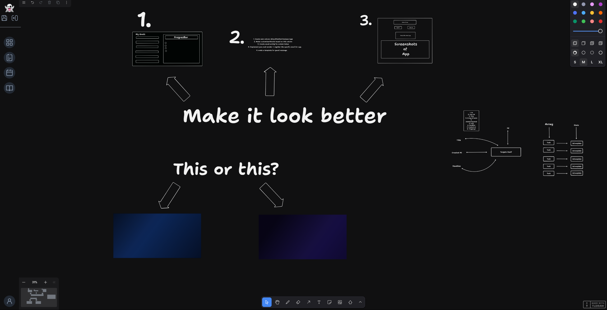
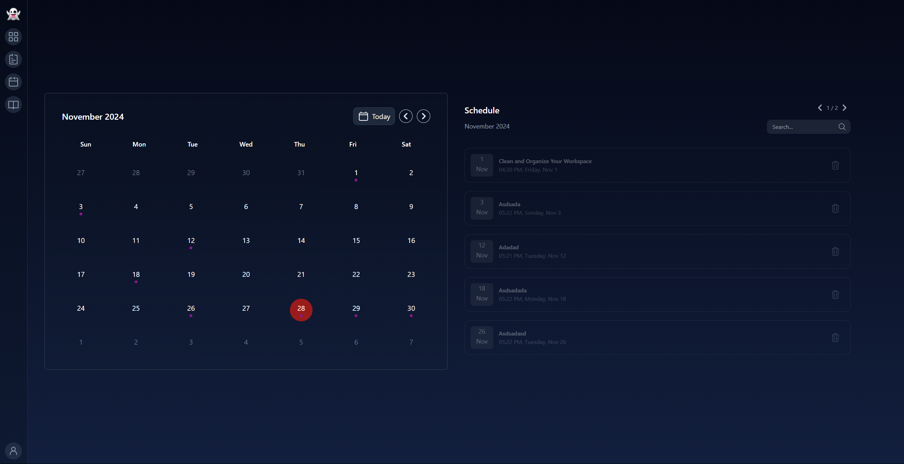
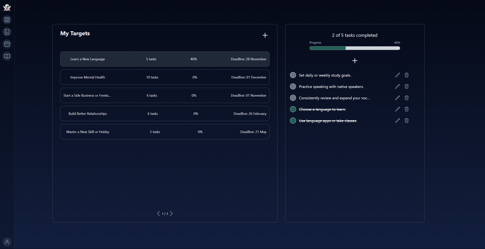
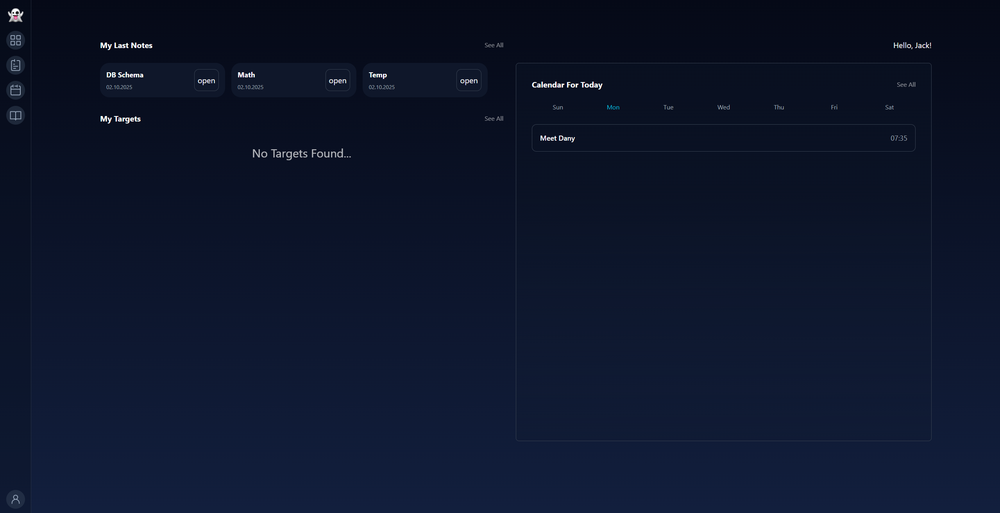
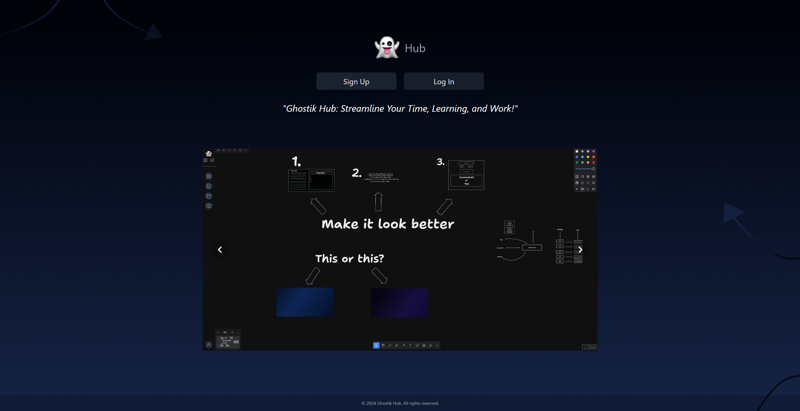

# GhostikHub
GhostikHub its a productivity platform for students and professionals, focused on note-taking, whiteboarding, and
resource management, search system.

## Table of Contents

1. [Preview](#1-preview)
2. [Stack](#2-stack)
3. [Requirements](#3-requirements)
4. [Quickstart](#4-quickstart)
5. [S3 Implementation](#5-s3-implementation)

## 1. Preview

|  |  |
|---|---|

|  |  |
|---|---|

|  |  |
|---|---|

## 2. Stack
- Java 17
- Spring
- Postgres
- Redis
- Docker
- AWS S3/Minio
- React
- Tailwindcss
- Tldraw

## 3. Requirements
- You need to create your own Gmail SMTP account for handling email verification.
- Docker/Docker Compose
- Java
- Node js

## 4. Quickstart
1. **Clone** the project.
   ```bash
   git clone https://github.com/GhostikX/GhostikHub.git
   ```
2. **Install** project dependencies for frontend.
   ```bash
   npm install
   ```
3. **Run the docker compose** in root directory of project`.
   ```bash
   docker-compose up -d
   ```
4. **Create your own Gmail SMTP account**`. 
    > Example: https://mailmeteor.com/blog/gmail-smtp-settings

5. **Add your credentials** in application.properties file.
    - Change `spring.mail.username=${MAIL_USERNAME}`
    - Change `spring.mail.password=${MAIL_PASSWORD}`

6. **Run backend and frontend**
    ```bash
    npm run dev
    ```


## 5. S3 Implementation
For local usage I used minio to store all files. But also I got implementation for AWS S3.
To use s3 u need to do these steps:
1. **Add your AWS credentials**
- Change `aws.access.key=${AWS_KEY}`
- Change `aws.secret-key=${AWS_SECRET_KEY}`
- Change `aws.region=${AWS_REGION}`
- Change aws.bucket=${BUCKET_NAME}
2. **Change Application Config implementation to use s3**
    > All code is ready just uncomment and comment minio code

3. **Change implementation of FileService from Minio to AWS**
    > Remove `@Serivce` annotation from Minio implementation and add to AWS implementation
    